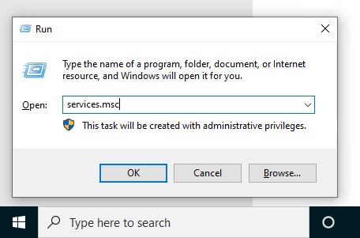
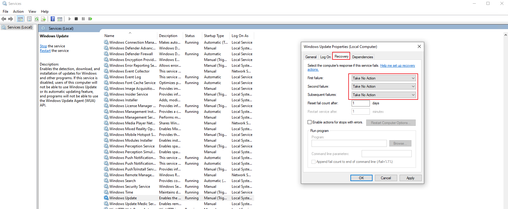
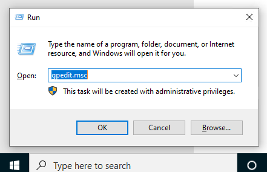
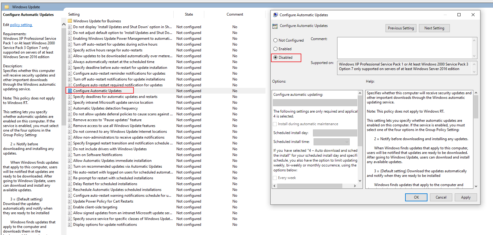
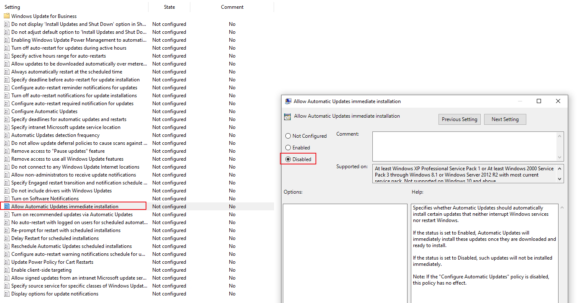

# SSTF Development Guide

## SSTF Development workflow introduction  
SSTF uses ["GitHub Flow"](https://guides.github.com/introduction/flow/). Github Flow is not perfect, but it's good enough for SSTF project now.

1. Anything in the master branch is deployable.
2. To work on something new, create a descriptively named branch off of master (ie: dev_github_branch)
   ```
   git checkout -b dev_github_branch
   ```
3. Commit to that branch locally and regularly push your work to the same named branch on the server. For the 1st time push, you may need to set upstream using below command
   ```
   git push --set-upstream origin github_flow
   ```
4. Once you think your development is done, run a test on your own development jenkins job.  
5. After the test in step 4 passed, and you think the branch is ready for merging, open a pull request. 
6. After someone else has reviewed and signed off on the feature, you can merge it into master.
7. Once it is merged and pushed to 'master', you can and should deploy immediately.
8. Clean your own develop branch. 


## New Jenkins job slave setup notes
1. Setup python environment.
   1. install python interpreter. 
   2. install SSTF requirements. 
2. Install Allure
3. Set environment variable "STU_Config". "SUT_Config" is the path where your local settings.py is.

### Notices for Windows OS slave
Sometimes, win10 OS slave may be automatically reset due to Window OS updating, 
resulting in loss of connection of salve or sudden interruption of running tasks. 
Therefore, we need to do some config to avoid it.

1. set the Windows update service:
   1. Launch the Run command (Win + R). Type in “services.msc” and hit Enter to open the service controller.
      
   2. Find the Windows update service, double click it and set its "Startup type" option value to "Manual"
      
   3. Click "Recovery" option and set its three option value to "Take No Action"
      
   4. Click "Apply" button and save settings.


2. set the Windows Group Policy
   1. Launch the Run command (Win + R). Type in “gpedit.msc” and hit Enter to open the group policy editor.
      
   2. Drill down through “Computer Configuration” to “Administrative Templates”. Select “Windows Components” and then “Windows Update”.
      
   3. Choose the option on the right to “Configure Automatic Updates.” Set it configure to "Disabled". Apply it and save.
      
   4. Choose the option on the right to "Allow Automatic Updates immediate installation". Set it configure to "Disabled". Apply it and save.
      

3. Weekly check needing security patch and manually install it.
   1. Open the application "Intel Security Checker"
      
   2. If existing any available updates patches, please timely install them.


## Development Jenkins Job usage guide.
1. repoPath: This parameter defines the absolute path of your repository on SSTF host
2. devBranch: This parameter defines which branch to test in this job. 
3. casePath: This parameter defines the relative path of SSTF. 
4. python interpreter path(optional): This parameter defines the absolute path of the python interpreter.
