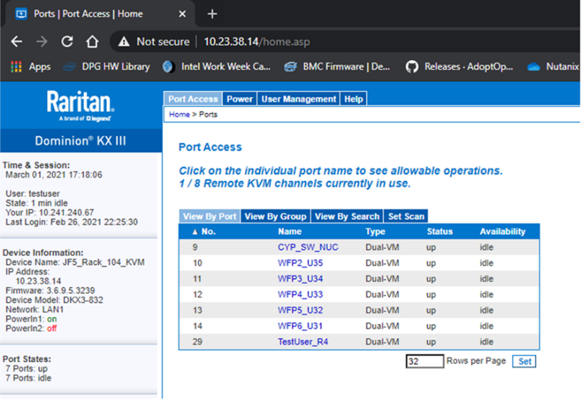

Material preparation
===================================

Before building, you need to prepare the VM and resource codes branch, that is, it is clear: where to build, and
 where to pull the code to build.
 
(1) Where to build?
-----------------
**a.Statistics server information** \
After the server equipment is in place, the hardware configuration of the equipment needs to be clarified in
 order to calculate the number of VMs that can be virtualized.\
Requirements for each VM: SSD 300G, Memory 16G, CPU 12Cores\
Intel® Xeon® Platinum 8280 CPU @ 2.70GHZ\
2 CPU*28 cores*2 threads=112 threads\
9 VM*12 threads = 108 threads\
Reserve 4 for the physical machine\
**For example:**\
This Server remote information:\
Hostname: J5S0330WF-HV.amr.intel.com\
Raritan Credentials：<https://10.23.38.14>\
Login: testuser\
This system is on port 29 of the KVM


BMC WebGui IP: 10.23.61.20\
L: TestUser

**b.Creat VM**\
After clarifying the number of built VMs, you can create VMs on the Server as CI agents. The basic process of 
creating the VM: Copy the VM image file created by the BIOS CI Team to the server OS, and then create a VM virtual 
machine based on the VM image file.
This process has been fully automated by the BIOS CI Team, and the specified build 
is triggered on Jenkins. This step can be completed automatically with parameters, and it takes about 2-3h.

The principal person in charge of this step:\
Zhang, Jianlin(WWID:11392771)\
Zhang, XuX A(WWID:11860103)

(2)Where to pull the code to build
-----------------
The BIOS is built and compiled by the code in multiple Git repositories. The BIOS of different platforms comes from 
different branches of the same git repository. For a new platform, we need to create a new branch to store the BIOS 
source code of the platform. When building the BIOS Image of the platform, pull the source code from this branch 
to build and compile.

**a. Create a new branch for the EagleStreamPc platform:**\
At present, all source code repositories used in BIOS development & CI in Intel use Edkrepo tool as an interface to 
manage related code repositories. When pulling and pushing warehouse code, edkrepo tool is used to operate.\
**Edkrepo document:**\
 <https://intel.sharepoint.com/sites/intel-uefi-continuous-integration-center>\
In addition, when creating a new branch, you need to specify the node (commit hash/tag) from which to create the new
 branch.\
**Branch naming rules:**\
 <https://intel.sharepoint.com/sites/intel-uefi-continuous-integration-center/SitePages/Naming-Conventions.aspx>\
New branch operation related commands:
```
edkrepo manifest
```
To view all manifest items managed by edkrepo, find EagleStreamRp
```
edkrepo clone <workspace> EagleStreamRp
```
Download the git repository code associated with EagleStreamRp
```
git config --global core.longpaths true
```
When downloading the warehouse code, some files will be downloaded incorrectly due to the file name being too long.
 You need to change the git configuration
```
cd <folderpath>
```
After edkrepo is downloaded, it contains five git warehouse codes, Intel, FDBin, EDK2, EDK2-staging, EDK2-platform. 
The branch building operation of each warehouse needs to be for a single git warehouse, so switch to the designated 
warehouse and create a branch. That is to create branches for five warehouses, five operations are required.
```
git checkout -b platform/eaglestreampc_dsg_main_temp 
EGLSTRM.0.RPB.0053.D.11
```
Create a new branch platform/eaglestreampc_dsg_main locally with EGLSTRM.0.RPB.0053.D.11 as the starting point
```
edkrepo shared-branch --create-platform EaglestreamPc --name dsg_main -v --dry-run Intel
```
Use the edkrepo shared-branch command to synchronize the local code to the new branch platform/eaglestreampc_dsg_main 
of the remote warehouse for the git repository of Intel. At the same time, a branch with the same name will be created 
locally. With the --dry-run parameter, you can test whether the shared-barnch command can run successfully, 
but it will not actually create a remote branch. After the test can run successfully, you need to remove the *make--dry
-run* parameter and re-execute the *shared-branch*command.

**b. Related link**\
Permission:\
<https://intel.sharepoint.com/sites/intel-uefi-continuous-integration-center/SitePages/Intel%20UEFI%20Continuous%20Integration%20Center/DOC2717806.aspx>\
Edkrepo installation:\
<https://intel.sharepoint.com/sites/intel-uefi-continuous-integration-center/SitePages/Intel%20UEFI%20Continuous%20Integration%20Center/EdkRepo%20Windows%20Installation%20Guide.aspx>\
Edkrepo beginner:\
<https://intel.sharepoint.com/sites/intel-uefi-continuous-integration-center/SitePages/EdkRepo-Beginners-Guide.aspx>\
Edkrepo user guide:\
<https://intel.sharepoint.com/sites/intel-uefi-continuous-integration-center/SitePages/Intel%20UEFI%20Continuous%20Integration%20Center/Doc2359500.aspx>