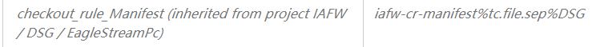
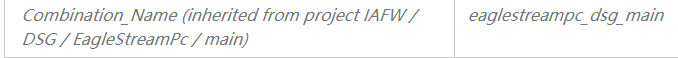
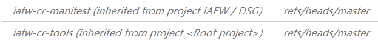
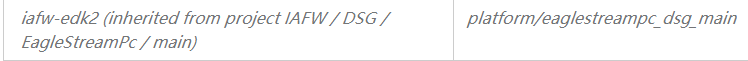
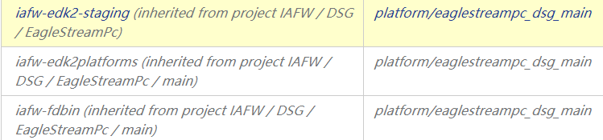
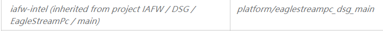
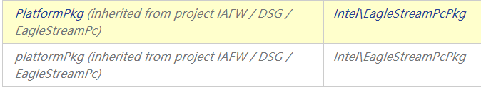
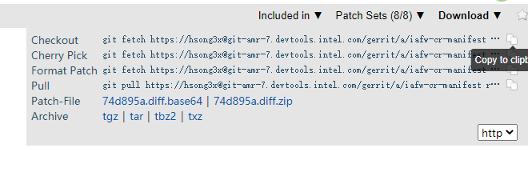

Configuration file
===================================
Bios build uses XML files to configure the key information needed in the BIOS Build process, such as which repository
 and branch to pull code from; which packages in the repository are pulled; what commands are executed during the build process; This file needs to be configured in the iafw-cr-manifest warehouse. The warehouse file will be pulled during the build, and the corresponding configuration file will be read to trigger the relevant build.
 
(1) Configure manifest XML file
----------------------------------------------------
Download the manifest warehouse and checkout to the iafw-cr-manifest repository
```
edkrepo clone <workspace> CrManifest
cd <workspace> && cd iafw-cr-manifest
```
For subsequent operations, you can use to create a local branch first, and push review after changing the manifest
 file on the local branch.
```
mkdir DSG
mkdir DSG/EagleStreamPc
mkdir DSG/EagleStreamPc/pins
```
create a folder to store the manifest file
```
cp DCG/EagleStreamRp/EagleStreamRpManifest.xml DSG/EagleStreamPc/EagleStreamPcManifest.xml
```
Documents related to Manifest file settings:\
<https://intel.sharepoint.com/sites/intel-uefi-continuous-integration-center/SitePages/Intel%20UEFI%20Continuous%20Integration%20Center/DOC2719191.aspx>
```
git add ./
```
Add the changes to the staging area
```
git commit -s
```
Add the changes to the local warehouse. After using this command, the git default editor will pop up, and edit the
 message and personal information of this commit in the editor **(signed_off_by)**.\
```
edkrepo send-review -v --dry-run
```
Submit the changes to the remote warehouse for review and merge\
If this change is found to be changed during the review process, after modifying the file locally, re-use the **git
 add, git commit --amend, edkrepo send-review** commands to manage the push changes, and the two review links are the
 same.
 
(2) Configure TeamCity Build Target
--------------------------------------------------------

**a.TeamCity Document:**\
<https://www.jetbrains.com/teamcity/learn/>

**b. BIOS CI Team TeamCity Server Information**\
<https://teamcity02-staging.intel.com/>\
<https://teamcity03-staging.intel.com/>\
<https://teamcity03-or.intel.com/login.html>\
<https://teamcity02-or.intel.com/login.html>\

BIOS CI tasks are mainly deployed on the 02 and 03 servers. The production environment with **or** is the actual 
execution of the build run task. The **staging** is the configuration/test environment, corresponding to the server 
for the production environment, configure the build target on the staging server, and then use **cac** to synchronize 
the staging related settings to the or production environment server.\
There is no agent that can be connected to the Staging, so you need to use the editor authority on the or to associate the agent for the newly created 
build target.

**c. Cac Related links:**\
<https://gitlab.devtools.intel.com/sfp-fie-infra/tc_config/tc02>\
<https://gitlab.devtools.intel.com/sfp-fie-infra/tc_config/tc03>\
<https://jks2-bios-prod.intel.com/view/CaC/job/1-CaC-PreMerge-Check/>\
<https://intel.sharepoint.com/sites/intel-uefi-continuous-integration-center/SitePages/Intel%20UEFI%20Continuous%20Integration%20Center/DOC2721363.aspx#>

After setting on staging02, the corresponding commit will be automatically generated on the staging branch of the 
corresponding gitlab project, and the configuration changes made by individuals can be submitted in the Jenkins job 
to produce a merge request.

After the Merge is passed, the setting changes on the staging will be automatically synchronized to the or server.
When operating cac, be careful not to submit a merge request after making a large number of configuration changes at 
once. In order to avoid parameter conflicts.\
When submitting a merge request, the commit hash character is subject to the commit record in gitlab.

**d. Configure TeamCity**\
Set the build target in the specified path based on the setting of the manifest.\
When setting the build target, you can copy the similar build target to the specified path, and then change the
 parameters 
that need to be changed: Pay attention to the parameter configuration: combination_name, remote-branch
, manifest_file_path, etc.

Pay attention to the template inherited by build target. If the parameter is inherited from the template, then make 
changes in the template. When copying, you can also copy the template. Note that after copy build target, remove its 
inherited original template.

Some important teamcity parameters:







The brand name used by the build for the git repository:


Label_id related to the image storage path generated by Daily build:



(3) Test whether the build works normally
-------------------------------------------------------------

After setting up the build target, since our own build target is based on our own git branch, we need to develop and
push related code of EagleStreamPC to the corresponding branch.\
Note that after developing the push code, and then pulling the remote warehouse to check whether the development 
of the push code is successful, the git command: **git sparse-checkout disable** is required. Because **sparse-checkout** 
is enabled by default in git in the project, the project is the setting of EagleStreamRp at this time, and only 
the relevant packages defined in the manifest file of EagleStreamRp are pulled.\
Now the manifest has not been merged, we need to test the manifest and build target to match and work. 

Manifest has not been merged, but there is a temporary changes branch generated on gerrit/teamforge.
You only need to modify the branch of the iafw-cr-manifest project to this changes branch when manually 
 running on teamcity02-or.

```
git fetch https://hsong3x@git-amr-7.devtools.intel.com/gerrit/a/iafw-cr-manifest refs/changes/09/125709/8 && git checkout FETCH_HEAD
```
The ```refs/changes/09/125709/8``` in the middle is the name of the generated temporary branch. Paste this branch name 
into the parameter iafw-cr-manifest value of TeamCity run, and then run to test whether the manifest file using 
review can be used make the corresponding build target work normally.\
When all build targets are working normally, you can merge the manifest file.
