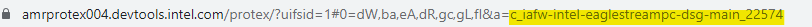
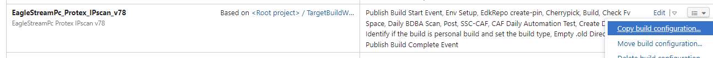
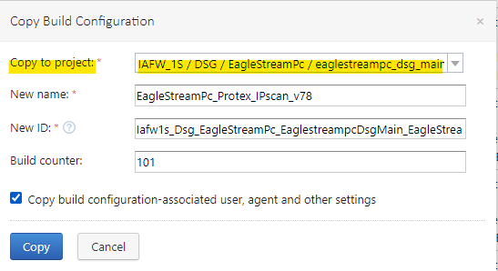
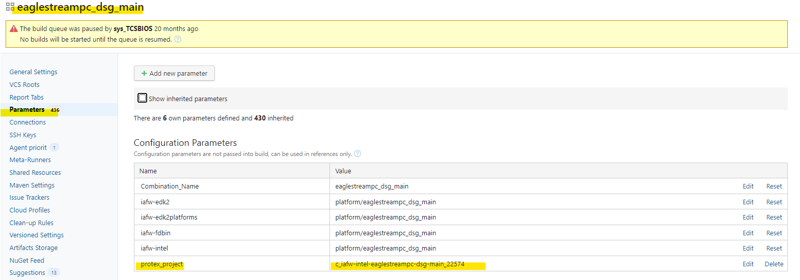
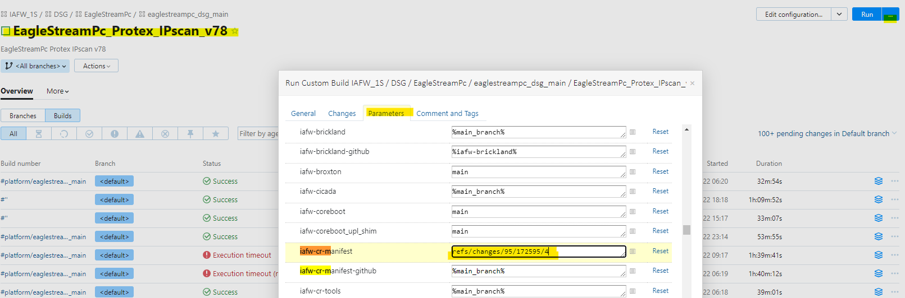
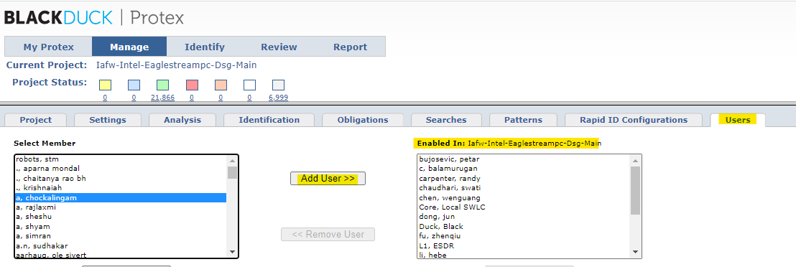

Protex scan
===================================

Protex server: https://amrprotex004.devtools.intel.com/

**1. Create protex scan project**

After applying for login permission to the protex server, you can clone a similar project when you want add a new protex
 project.
 
 How to clone a protex project? https://wiki.ith.intel.com/display/ITSFID/Cloning+a+Protex+Project
 
**2. Update the manifest**
 
 add protex build target and build step:
 ```
<Build target="EagleStreamPc_Protex_IPscan_v78" type="daily" />

<BuildTarget name="EagleStreamPc_Protex_IPscan_v78" description="EagleStreamPc Protex IPscan v78" targetType="protex">
    <StepList>
      <Step>(if exist %checkoutDir%\Intel\ClientOneSiliconPkg\InternalOnly\Tools\gen_dec.py ( c:\python33\python %checkoutDir%\Intel\ClientOneSiliconPkg\InternalOnly\Tools\gen_dec.py %checkoutDir%\Intel\ClientOneSiliconPkg\InternalOnly\Tools\SiPkg.dec.template Emmitsburg %checkoutDir%\Intel\ClientOneSiliconPkg\SiPkg.dec ) else ( echo Generate SiPkg.dec from other process ))</Step>
      <Step>c:\python33\python %checkoutDir%\iafw-cr-tools\xpg-tools\IpClean\ipclean.py -c %checkoutDir%\iafw-cr-tools\xpg-tools\IpClean\IniFiles\ipclean_EagleStream_Pc.ini --in_place --source_base %checkoutDir%</Step>
      <Step>c:\python36\python %checkoutDir%\iafw-cr-tools\xpg-tools\Protex\scan_protex_project.py --checkout_dir %checkoutDir% --protex_folder %checkoutDir%\protex\ --protex_repos FDBin Intel --ip_server amrprotex004.devtools.intel.com --protex_account %protex_account% --protex_pw %protex_pw% --protex_project c_iafw-intel-eaglestreampc-dsg-main_22574</Step>
    </StepList>
</BuildTarget>

```
**--protex_project c_iafw-intel-eaglestreampc-dsg-main_22574**

--protex_project followed by the ID of the protex project, taken from the corresponding link of the cloned project.


**3. add protex_IP_scan target to Teamcity**

You can copy another target.



update the protex_project parameters from eaglestreampc_dsg_main combo level and the next level of protex target
   will inherit this parameter.


**4. Test run the protex_IP_scan target in teamcity**



**5. Add user to protex project**

If someone has applied for permission to the protex server but still can't see the protex project, please look for his
 name in the users enabled list. If not, select his name and select the Add User button.
 