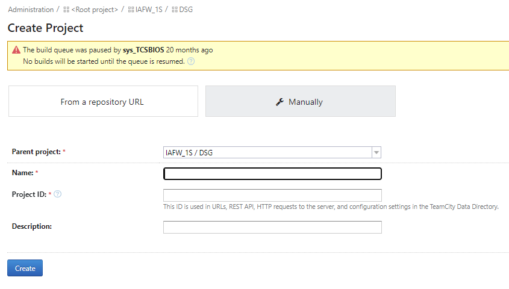

# Birchstream build process

## Intro

Birchstreampc platform is next generation server products ,so we need to enable CI configuration for Birchsteampc commercial BIOS.

## File new Jira ticket

[https://jira.devtools.intel.com/browse/CRJ-12846](https://jira.devtools.intel.com/browse/CRJ-12846)

## Create new platform branch for all code repos

+ create branch for five repos with similar command based on tag : BCHSTRM.0.RPB.0016.D.30

  ```
  git checkout -b platform/birchstreampc_dsg_main_temp BCHSTRM.0.RPB.0016.D.30
  ```

  ```
  edkrepo shared-branch --create-platform BirchstreamPc --name dsg_main -v --dry-run Intel
  ```

  ```
  edkrepo shared-branch --create-platform BirchstreamPc --name dsg_main -v Intel
  ```

## Create new manifest file

+ create new combo and specify repo branch
+ Specify the path to the new platform xml file in Cindex.xml, otherwise the corresponding manifest file will not be found when running the manifest check build

 ```
  <Project name="BirchStreamPc" xmlPath="DSG/BirchStreamPc/BirchStreamPcManifest.xml" />
 ```

+ Manifest patch merged : [https://github.com/intel-innersource/firmware.boot.uefi.iafw.devops.ci.cr.manifest/pull/7426](https://github.com/intel-innersource/firmware.boot.uefi.iafw.devops.ci.cr.manifest/pull/7426)

## Configure new build targets 

+ create subproject : BirchStreamPc
  + enter DSG config UI and create subprojects ,
  + fill out name then project ID is auto-generated with name



+ enter BirchStreamPc config UI and create subproject: [birchstreampc_dsg_main](https://teamcity02-staging.intel.com/admin/editProject.html?projectId=Iafw1s_Dsg_BirchStreamPc_BirchstreampcDsgMain)
  + Creation process is the same as BirchStreamPc
  + The name of subprojects here correspond to the name of the combo

+ create build configurations/targets
  + When we create build target，it's better to attach the correct template and the template usually is "TargetBuildWindowsTemplate" under root project.
  + Some specific parameters can be overridden after the build configuration is created, basically we will not be overridden at the build target level.

