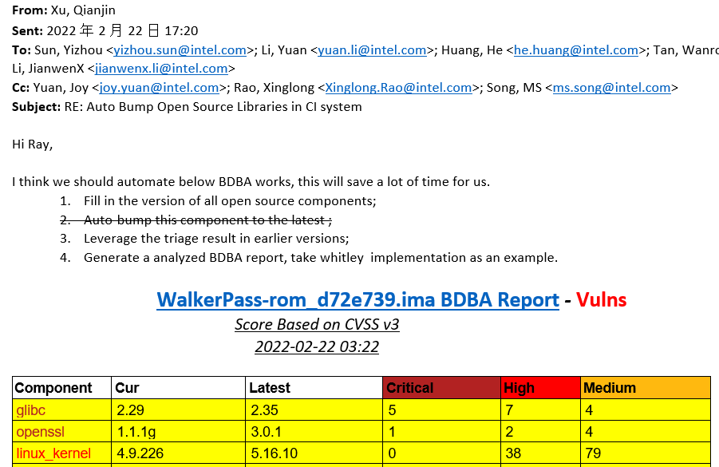
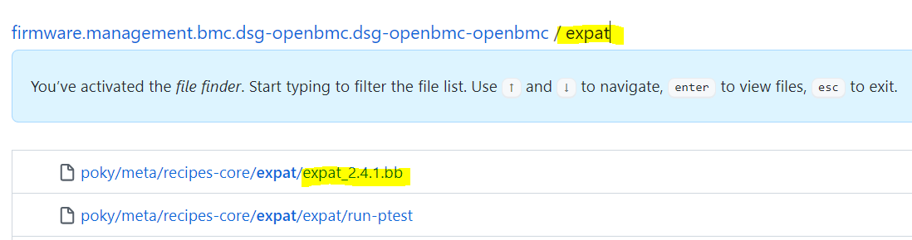
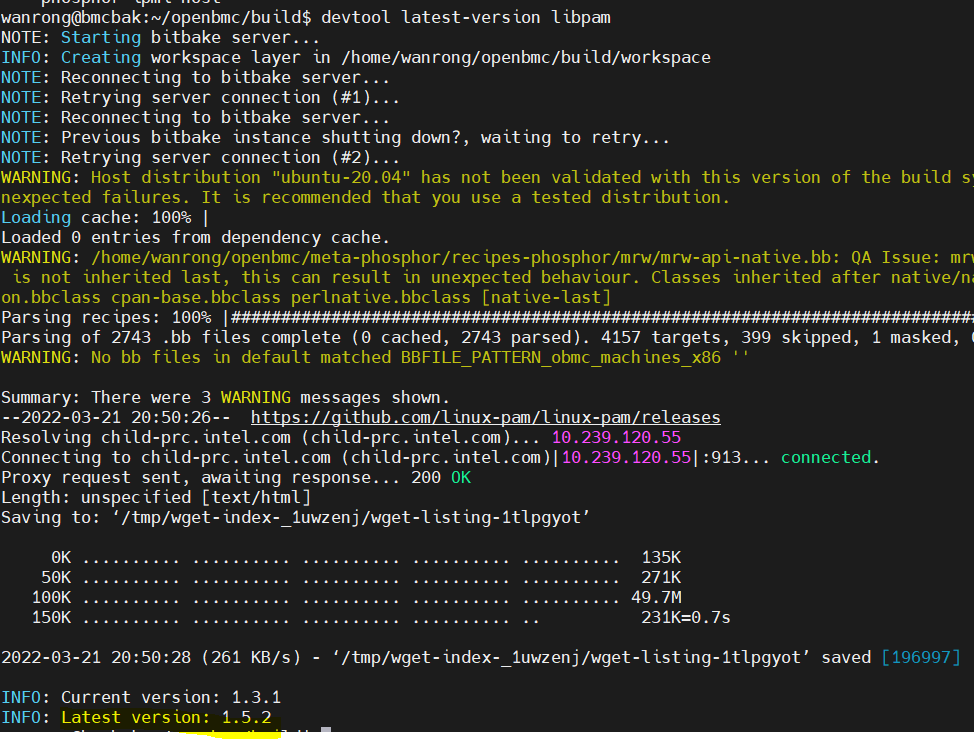
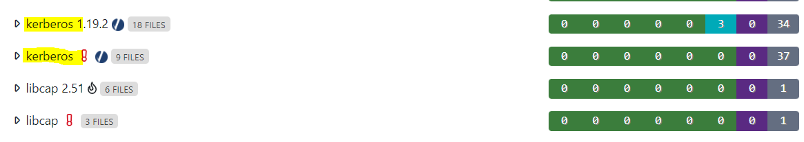
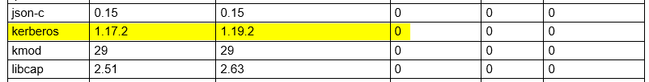
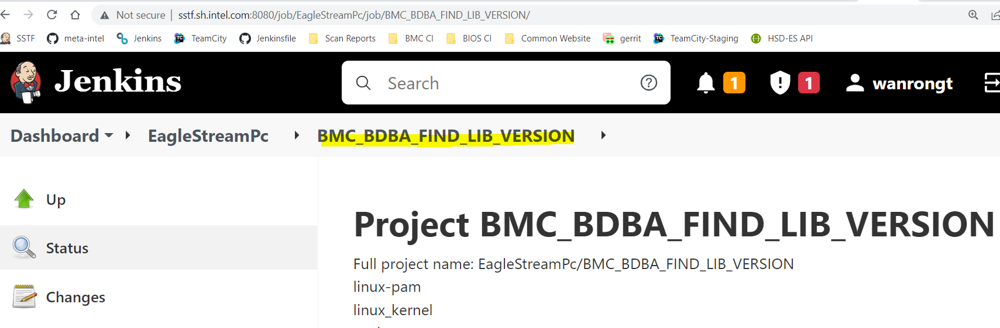

# BDBA Scan Report
## Task Requirement:

Here are the details about requirement requested by Xu,Qianjin:

1. Fill in the version of all open source  components;
2. Leverage the triage result in earlier versions;
3. Generate a analyzed BDBA report, take Whitley implementation as an example.


## Task breakdown

1.Determine current versions of all the open source libraries for EaglestreamPc

(1) Lib with bb files in "dsg-openbmc-openbmc" code repo

+ Extract lib version from bb files name, take "expat" as a example


(2) Lib without bb files in code repo

+ use devtool to obtain version

```
cd ~/openbmc/
rm -rf build/
export TEMPLATECONF=/home/wanrong/openbmc/openbmc-meta-intel/meta-egs/conf/
source oe-init-build-env
```

```
devtool latest-version {lib_name}
devtool search {lib_name}
```

+ Take lib "libpam" as a example:


+ Record current lib name without bb files:

| BDBA Library | Latest  Version | Current  Version | Lib  name in code |
| :----------: | --------------- | ---------------- | ----------------- |
| linux-pam    | 1.5.2           | 1.3.1            | libpam            |
| linux_kernel | 5.16.11         | 5.10.67          | linux-aspeed      |
| mtd          | 2.1.3           | 1.1.6            | mtdev             |
| python       | 3.9.6           | 3.9.6            | python3           |
| kmod         | 29              | 29               | kmod              |
| tdb          | 1.4.6           | 1.4.3            | libtdb            |
| liblzo2      | 2.1             | 2.1              | lzo               |
| libiniparser | 4.1             | 4.1              | iniparser         |
| kerberos     | 1.17.2          | 1.17.2           | krb5              |
| safestring   | None            | 3.4              | safec             |
| systemd-shim | None            | 249.3            | systemd           |


2.Update the open source library to the correct version, consistent with the one on the BDBA server

(1)BDBA API

  BDBA API LINK: [https://bdba001.icloud.intel.com/help/api/#api-endpoints](https://bdba001.icloud.intel.com/help/api/#api-endpoints)

(2)Use **cur** command to get info from BDBA server ,such as open source libraries list

  + List groups:

  ```
  curl -k -s https://bdba001.icloud.intel.com/api/groups/
  ```

  + Get analysis results:

  ```
  curl -k -s https://bdba001.icloud.intel.com/api/product/
  ```

  + Add/modify version overrides

  ```
  curl -k -s -X POST -T "+VERSION_OVERRIDE_JSON_PATH+" https://bdba001.icloud.intel.com/api/versionoverride/
  ```

3.Optimize the format of the BDBA report

+ Clean the data from BDBA server and match lib name to lib version in use while generating final table


## Script design
1.Introduction：

Override BDBA open source library version that bdba website recognizes incorrectly and generated analyzed report every week.

2.Easy to use:

(1) Trigger build job ["BMC_BDBA_FIND_LIB_VERSION"]( http://sstf.sh.intel.com:8080/job/EagleStreamPc/job/BMC_BDBA_FIND_LIB_VERSION/) in SSTF server



(2) Download script from github repo ["**Scan_Report_Mail**"](https://github.com/wanrongt/Scan-Report-Mail-Notification/tree/main/Scan_Report_Mail)and Run it with python3 Environment

3.Main process:

```
(1)Use Jenkins API to get daily build version and BDBA report link

(2) Get analysis results and Extract lib name list from json data

(3) Find all the lib version and Add version overrides

(6) Create analyzed report and Send mail
```