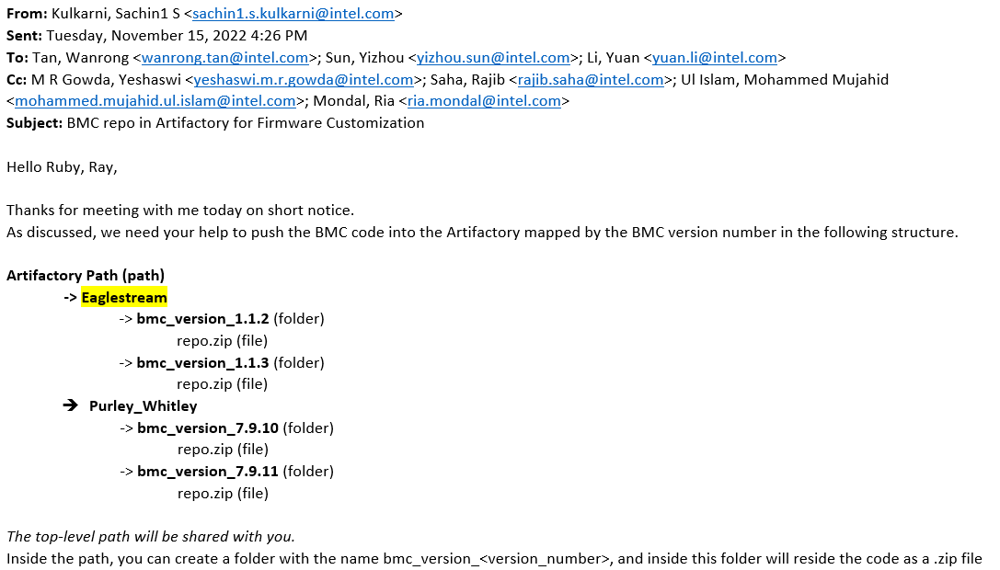
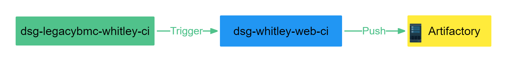
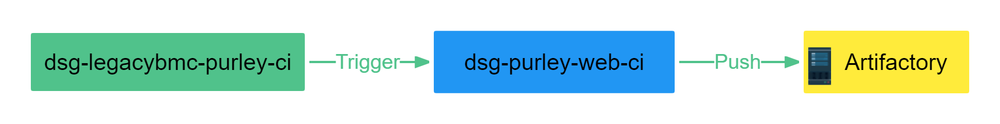
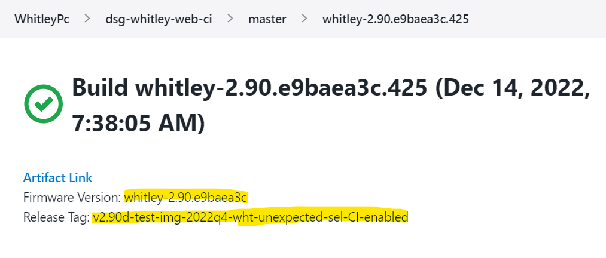

# EGS/Whitley/Purley BMC Web code for Firmware Customization

## Task Requirement

Here are the details about requirement requested by Kulkarni, Sachin1 S :

+ Packaging and push Web-based User Interface code of firmware BMC to Artifactory

+ Match the external release versions with the ones released in the Artifactory 



## Task Details

### 1.Eaglestream

#### (1)Workflow

- Pipeline **“dsg-openbmc-release-ci”** is timely triggered every  Thursday to generated weekly release package that is part of SUP package.

- New pipeline **“dsg-openbmc-web-ci”**  will be triggered as the downstream pipeline of “dsg-openbmc-release-ci”  and push intel-webui code with BMC version accordingly to the Artifactory.


 #### (2) Build Pipeline

- Pipeline Dsg-openbmc-release-ci : [https://cbjenkins-pg.devtools.intel.com/teams-dsgbmc/job/dsgbmc/job/EagleStreamPc/job/dsg-openbmc-release-ci/job/master/](https://cbjenkins-pg.devtools.intel.com/teams-dsgbmc/job/dsgbmc/job/EagleStreamPc/job/dsg-openbmc-release-ci/job/master/)
- Pipeline Dsg-openbmc-web-ci: [https://cbjenkins-pg.devtools.intel.com/teams-dsgbmc/job/dsgbmc/job/EagleStreamPc/job/dsg-openbmc-web-ci/job/master/](https://cbjenkins-pg.devtools.intel.com/teams-dsgbmc/job/dsgbmc/job/EagleStreamPc/job/dsg-openbmc-web-ci/job/master/)
- EGS Artifactory Dir:  [https://ubit-artifactory-ba.intel.com/artifactory/firmware-customization-portal-ba-local/egs_bmc_web/](https://ubit-artifactory-ba.intel.com/artifactory/firmware-customization-portal-ba-local/egs_bmc_web/)

- Package name : 
 ```
  <bmc-version>.<build_number>.zip
 ```
 ### 2.Whitley 

#### (1)Workflow

- Dev will trigger pipeline **“dsg-legacybmc-whitley-ci”** to     execute release build based on different release tag/version as release candidate and one of these will be next external release. 

- New pipeline “**dsg-whitley-web-ci**”  will be triggered as downstream pipeline after each release build and will upload web module code to Artifactory based on each release tag as archive files.

- Once the external release is confirmed, you won’t miss any BMC release version and can download the matching BMC version of the code in the Artifactory server.

 

#### (2) Build Pipeline

- Pipeline dsg-legacybmc-whitley-ci : [https://cbjenkins-pg.devtools.intel.com/teams-dsgbmc/job/dsgbmc/job/WhitleyPc/job/dsg-legacybmc-whitley-ci/job/master/](https://cbjenkins-pg.devtools.intel.com/teams-dsgbmc/job/dsgbmc/job/WhitleyPc/job/dsg-legacybmc-whitley-ci/job/master/)
- Pipeline dsg-whitley-web-ci : [https://cbjenkins-pg.devtools.intel.com/teams-dsgbmc/job/dsgbmc/job/WhitleyPc/job/dsg-whitley-web-ci/job/master/](https://cbjenkins-pg.devtools.intel.com/teams-dsgbmc/job/dsgbmc/job/WhitleyPc/job/dsg-whitley-web-ci/job/master/)
- Whitley  Artifactory Dir: [https://ubit-artifactory-ba.intel.com/artifactory/firmware-customization-portal-ba-local/whitley_bmc_web/](https://ubit-artifactory-ba.intel.com/artifactory/firmware-customization-portal-ba-local/whitley_bmc_web/)

 ### 3.Purley

 #### (1)Workflow

Purley’s workflow is the same as Whitley’s.



#### (2) Build Pipeline

- Pipeline  dsg-legacybmc-purley-ci : [https://cbjenkins-pg.devtools.intel.com/teams-dsgbmc/job/dsgbmc/job/PurleyPc/job/dsg-legacybmc-purley-ci/job/master/](https://cbjenkins-pg.devtools.intel.com/teams-dsgbmc/job/dsgbmc/job/PurleyPc/job/dsg-legacybmc-purley-ci/job/master/)

- Pipeline  dsg-purley-web-ci : [https://cbjenkins-pg.devtools.intel.com/teams-dsgbmc/job/dsgbmc/job/PurleyPc/job/dsg-purley-web-ci/job/master/](https://cbjenkins-pg.devtools.intel.com/teams-dsgbmc/job/dsgbmc/job/PurleyPc/job/dsg-purley-web-ci/job/master/)

- Firmware version and release tag of each web-ci build are also listed as shown below.
 

 
+ Purley Artifactory Dir:  [https://ubit-artifactory-ba.intel.com/artifactory/firmware-customization-portal-ba-local/purley_bmc_web/](https://ubit-artifactory-ba.intel.com/artifactory/firmware-customization-portal-ba-local/purley_bmc_web/)