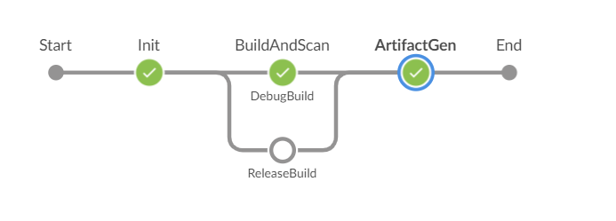
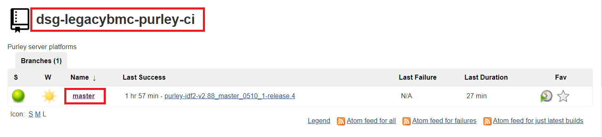
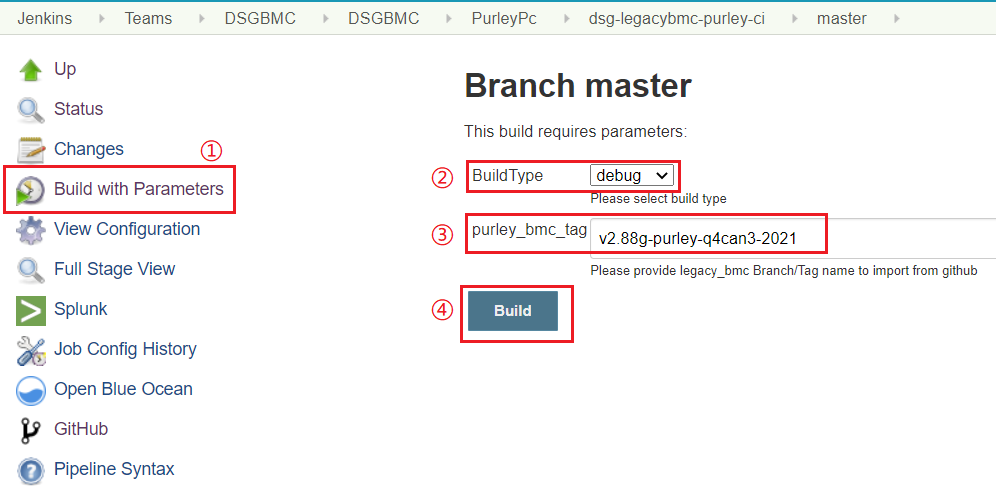
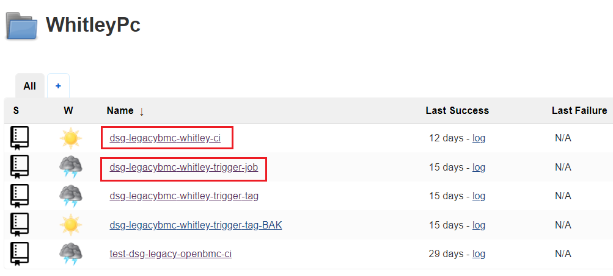
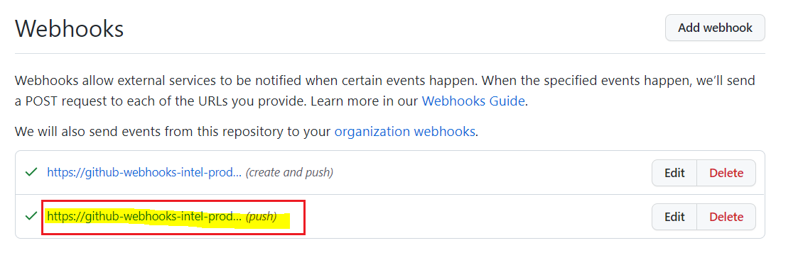
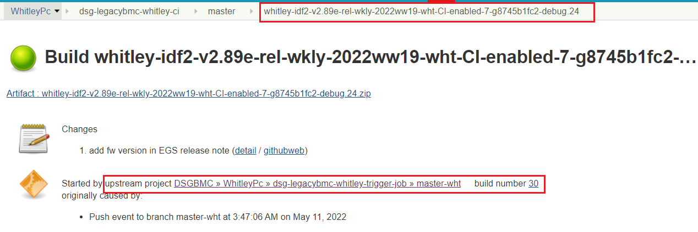
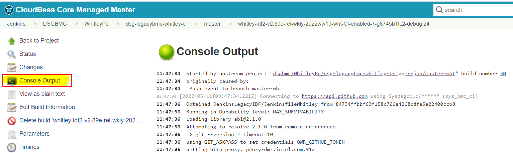
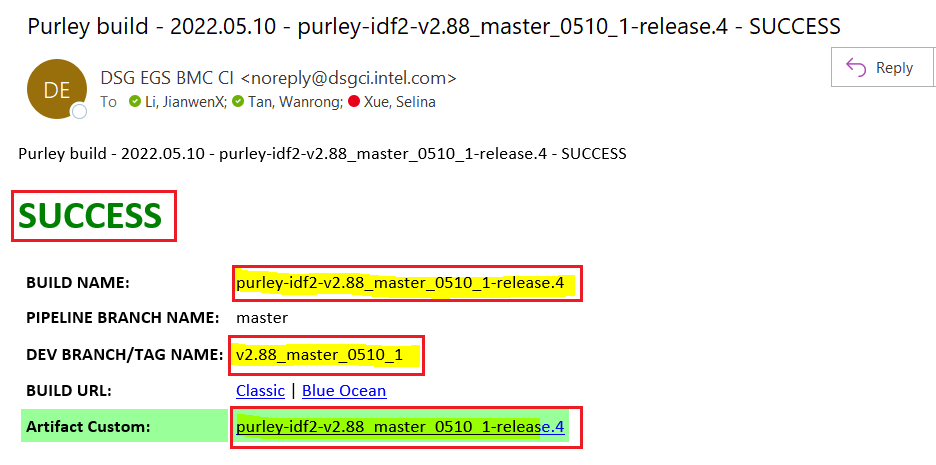

# Legacy BMC CI Process

## Introduction

+ Legacy BMC firmware (Board Management Controller) is used to monitor devices such as CPU, PSU (Power Supply Unit), SSD (Solid State Drive) on Purley/Whitley server platforms. 

+ Our DSG CI team is expected to standardize an efficient process of CI/CD with high performance for Commercial BMC FW of Purley/Whitley in SH site.

## Build Preparation 

### Code Repo

+ **[dsg-legacy-bmc](https://github.com/intel-collab/firmware.management.bmc.legacy.dsg-legacy-bmc)**: Purley and Whitley platforms have common code repo in Intel-collab organization

### Build Key

Debug and release build key related files need to be stored in build server before Purley/Whitley CI build.

#### 1.Debug build key

- debug build key is obtained by local host .

- file path of debug build key: 

  ```
  /usr/local/etc/deg-bmcfw/configs-purley/keystore/Purley/developmentKeys.tar.gz
  ```

+ debug build key generally does not need to be updated.

#### 2.Release build key

- Release build key is obtained via Tulum server with SSH connection 

  ```
  Hostname tulum.jf.intel.com
  User epsdfw
  IdentityFile ~/.ssh/epsdfw-id_rsa
  ```

+ file path of release build key:

  ```
  /usr/local/etc/deg-bmcfw/configs-purley/keystore/Purley/Production-Key-2015-Sep-25
  ```

+ Server for storing release build’s key is maintained by Vernon and this server won't retire from storing key duties in foreseeable future.

####  3. KVM Key

- File path:     

  ```
  /usr/local/sbin/IntelSign/signfile-lin-x64-4.0.87/SignFile.config.xml
  ```

+ KVM Key is updated every six months, and new key could be obtained from EDSS website.

### Intel Sign Tool

- Sign is necessary step for both debug build and release build so tools need to be stored in build server before build.

- File path:

  ```
  /usr/local/sbin/IntelSign
  ```

- Intel sign tool is usually not updated.

### Build Command

For legacy BMC, it have two types of builds : debug build and release build.

#### 1.Debug build:   

```
BUILD_NUMBER=$number MYMCU=AST2500 ./scripts/build.sh
```

#### 2.Release build:     

```
BUILD_NUMBER=$number MYMCU=AST2500 ./scripts/build.sh --release
```

### Build Configuration Files

All the configuration files are store in [openbmc-jenkins](https://github.com/intel-collab/firmware.management.bmc.dsg-openbmc.openbmc-ci.openbmc-jenkins/commits/master) repo.

(1) Buildconfig.json

+ Build script
+ Artifactory directory

(2) Manifest.xml

+ Code repo info : repo link 、faceless account

(3) PackageGen.json

+ Specify  the files to package

(4) Jenkinsfile

+ build stage

### Build Agent

#### 1. OS requirements: 

+ ubuntu 20.04.3 LTS

#### 2. Open Source Libraries/Tools:

| **uboot-mkimage** | **libxtst-dev**    |
| ----------------- | :----------------- |
| **lib32stdc++6**  | **g++-5-multilib** |
| **lib32z1**       | **gcc-5-multilib** |
| **meson**         | **Python 3.8.2**   |
| **libglib2.0**    | **Python 2.7**     |

#### 3. Config info of docker image 

 (1) Docker file : 

+ [Docker file repo](https://github.com/intel-innersource/frameworks.devops.delivery-packaging-framework.dockerfiles/blob/main/openbmc_image/legacy/Dockerfile) in the intel-innersource

 (2) Docs:

+ [Docker installation Docs](https://docs.docker.com/engine/install/ubuntu/)
+ [Docker installation tutorials](https://www.simplilearn.com/tutorials/docker-tutorial/how-to-install-docker-on-ubuntu)

(3) Intel Video Portal

+ [https://videoportal.intel.com/media/0_b1buwues](https://videoportal.intel.com/media/0_b1buwues)

+ [https://videoportal.intel.com/media/0_7fqoz9lt](https://videoportal.intel.com/media/0_7fqoz9lt)

## Build Flow

We are expected to enable below three build types:

(1) Purely FW Release build 

(2) Whitley FW Release build

(3) Whitley PR debug build

 ### Purely FW Release build 

#### 1.Build job:  [dsg-legacybmc-purley-ci](https://cbjenkins-pg.devtools.intel.com/teams-dsgbmc/job/dsgbmc/job/PurleyPc/job/dsg-legacybmc-purley-ci/job/master/)


#### 2.How to trigger build based on tag in Jenkins

+ (1). Click on "Build with Parameters" to manually trigger build 
+ (2). Click on "Build Type" to choose build type: debug or release
+ (3) Click on "purley_bmc_tag" to fill in the tag name, and the default value is "v2.88g-purley-q4can3-2021"
+ (4). Click on  "Build" to run this build job



### Whitley PR debug build

#### 1.Trigger job: [dsg-legacybmc-whitley-trigger-job](https://cbjenkins-pg.devtools.intel.com/teams-dsgbmc/job/dsgbmc/job/WhitleyPc/job/dsg-legacybmc-whitley-trigger-job/job/master-wht/)

#### 2.Build job: [dsg-legacybmc-whitley-ci](https://cbjenkins-pg.devtools.intel.com/teams-dsgbmc/job/dsgbmc/job/WhitleyPc/job/dsg-legacybmc-whitley-ci/)



#### 3.How to trigger build

(1) Auto-trigger Mechanism

+ We set up a [Webhook](https://github.com/intel-collab/firmware.management.bmc.legacy.dsg-legacy-bmc/settings/hooks) for Legacybmc code repo and this webhook will keep our trigger job to be notified when code push events happen. 

+ Once trigger job has been notified, the trigger job will trigger downstream job: "dsg-legacybmc-whitley-ci".

(2) Manual-trigger Method

+ The trigger method is the same as Purely FW Release build.

### Whitley FW Release build

#### 1.Trigger job: [dsg-legacybmc-whitley-trigger-tag](https://cbjenkins-pg.devtools.intel.com/teams-dsgbmc/job/dsgbmc/job/WhitleyPc/job/dsg-legacybmc-whitley-trigger-tag/)

#### 2.Build job: [dsg-legacybmc-whitley-ci](https://cbjenkins-pg.devtools.intel.com/teams-dsgbmc/job/dsgbmc/job/WhitleyPc/job/dsg-legacybmc-whitley-ci/)

#### 3.How to trigger build

(1) Auto-trigger Mechanism

+ When a new tag is generated , this trigger job will receive the notification from webhook.
+ Then trigger job will trigger downstream job: "dsg-legacybmc-whitley-ci".

(2) Manual-trigger Method

+ The trigger method is the same as Purely FW Release build.

## Troubleshoot build failure

If you encounter build failure,pls click on "Console Output" to view the build log to find the root cause.


## Build Result Post

Once build complete,the mail notification will deliver to related recipient. 

The mail includes build info -- build result , Artifactory link and so on.

