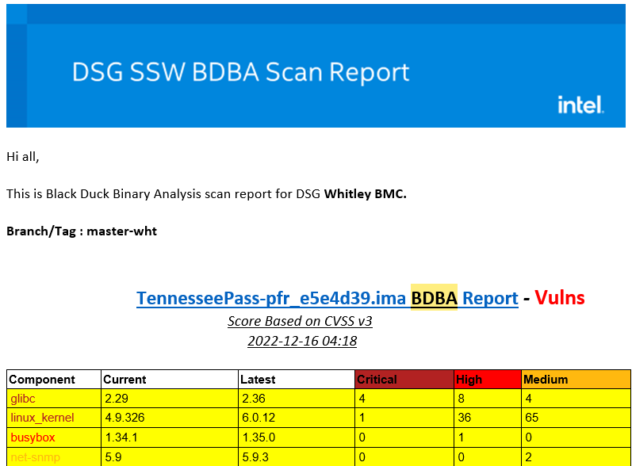
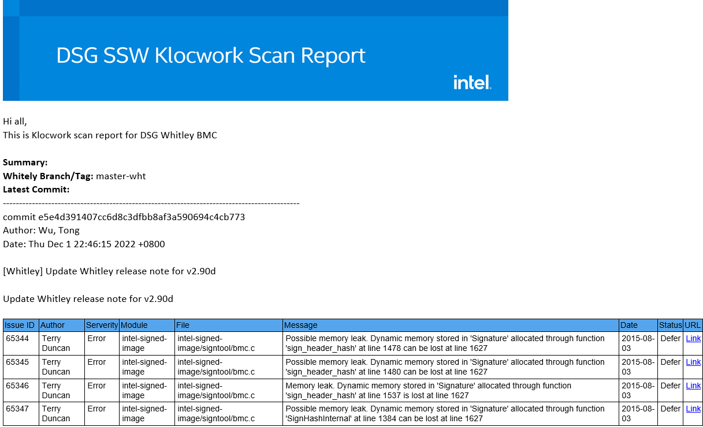

# Purley and Whitley BMC Scan

## Black Duck Binary Analysis(BDBA) Scan

### 1.BDBA Scan build

#### (1) Workflow

a. Git clone code with specified branch

```
git clone -b ${branch} https://github.com/intel-collab/firmware.management.bmc.legacy.dsg-legacy-bmc.git
git lfs pull
```

b. Execute build command

+ Purley

```
make TARGET_ID=WalkerPass BUILD_JOBS=-j32
```

+ Whitley

```
scripts/build.sh
```

c. Upload WalkerPass and TennesseePass build binary files to BDBA server with BDBA API

```
curl -k -s https://bdba001.icloud.intel.com/api/upload/
```

d. Add version overrides for report component 

```
curl -k -s -X POST -T "+VERSION_OVERRIDE_JSON_PATH+" https://bdba001.icloud.intel.com/api/versionoverride/
```

e. Deliver delicate mail notification



#### (2) BDBA Build pipeline

+ Purley/Whitley build server: legacybmc.sh.intel.com (IP: 10.239.138.118)

- Purley build job: [https://cbjenkins-pg.devtools.intel.com/teams-dsgbmc/job/dsgbmc/job/PurleyPc/job/dsg-purley-bdba-ci/job/master/](https://cbjenkins-pg.devtools.intel.com/teams-dsgbmc/job/dsgbmc/job/PurleyPc/job/dsg-purley-bdba-ci/job/master/)
- Purley Jenkinsfile: [https://github.com/intel-collab/firmware.management.bmc.dsg-openbmc.openbmc-ci.openbmc-jenkins/blob/master/JenkinsLegacyIDF/JenkinsfileBDBAPurley](https://github.com/intel-collab/firmware.management.bmc.dsg-openbmc.openbmc-ci.openbmc-jenkins/blob/master/JenkinsLegacyIDF/JenkinsfileBDBAPurley)
- Whitley build job: [https://cbjenkins-pg.devtools.intel.com/teams-dsgbmc/job/dsgbmc/job/WhitleyPc/job/dsg-whitley-bdba-ci/job/master/](https://cbjenkins-pg.devtools.intel.com/teams-dsgbmc/job/dsgbmc/job/WhitleyPc/job/dsg-whitley-bdba-ci/job/master/)
- Whitely Jenkinsfile: [https://github.com/intel-collab/firmware.management.bmc.dsg-openbmc.openbmc-ci.openbmc-jenkins/blob/master/JenkinsLegacyIDF/JenkinsfileBDBAWhitley](https://github.com/intel-collab/firmware.management.bmc.dsg-openbmc.openbmc-ci.openbmc-jenkins/blob/master/JenkinsLegacyIDF/JenkinsfileBDBAWhitley)

### 2.BDBA Scan report

#### (1)Report Server

+ BDBA Server link: https://bdba001.icloud.intel.com/#/groups/32

## Klocwork Scan

### 1. KW Scan build

#### (1) Workflow

a. Git clone code with specified branch

```
git clone -b ${branch} https://github.com/intel-collab/firmware.management.bmc.legacy.dsg-legacy-bmc.git
git lfs pull
git clean -d -f -x; make clean_all;
```

b. Execute build command

+ Purley

  ```
  /home/kuiying/kw20.1.0.97/bin/kwinject make TARGET_ID=BuchananPass BUILD_JOBS=-j8;
  ```

+ Whitley

  ```
  /home/kuiying/kw20.1.0.97/bin/kwinject make TARGET_ID=CoyotePass BUILD_JOBS=-j8;
  ```

c. Analyze the code and generate tables

```
/home/kuiying/kw20.1.0.97/bin/kwbuildproject --url http://bmcbuild2.sh.intel.com:8080/Purley -o/home/kuiying/kwtables/Purley --force /home/kuiying/purley/deg-bmcfw-core/kwinject.out --verbose | tee ./kwbuildpur.log
```

d. Upload tables to Klocwork server

```
/home/kuiying/kw20.1.0.97/bin/kwadmin --url http://bmcbuild2.sh.intel.com:8080/ set-project-property Purley enable_group_calculations false

/home/kuiying/kw20.1.0.97/bin/kwadmin --url http://bmcbuild2.sh.intel.com:8080/ set-project-property Purley grouping_on_default false

/home/kuiying/kw20.1.0.97/bin/kwadmin  --url http://bmcbuild2.sh.intel.com:8080/ load Purley /home/kuiying/kwtables/Purley/ --verbose --name build_pur_$BUILD_ID")
```

e. Deliver delicate report notification



#### (2) KW build pipeline

+ Purley build job: [https://cbjenkins-pg.devtools.intel.com/teams-dsgbmc/job/dsgbmc/job/PurleyPc/job/dsg-purley-klocwork-ci/job/master/](https://cbjenkins-pg.devtools.intel.com/teams-dsgbmc/job/dsgbmc/job/PurleyPc/job/dsg-purley-klocwork-ci/job/master/)

+ Purley Jenkinsfile: [https://github.com/intel-collab/firmware.management.bmc.dsg-openbmc.openbmc-ci.openbmc-jenkins/blob/master/JenkinsLegacyIDF/JenkinsfileKWPurley](https://github.com/intel-collab/firmware.management.bmc.dsg-openbmc.openbmc-ci.openbmc-jenkins/blob/master/JenkinsLegacyIDF/JenkinsfileKWPurley)

- Whitley build job: [https://cbjenkins-pg.devtools.intel.com/teams-dsgbmc/job/dsgbmc/job/WhitleyPc/job/dsg-whitley-klocwork-ci/job/master/](https://cbjenkins-pg.devtools.intel.com/teams-dsgbmc/job/dsgbmc/job/WhitleyPc/job/dsg-whitley-klocwork-ci/job/master/)
- Whitely Jenkinsfile: [https://github.com/intel-collab/firmware.management.bmc.dsg-openbmc.openbmc-ci.openbmc-jenkins/blob/master/JenkinsLegacyIDF/JenkinsfileKWWhitley](https://github.com/intel-collab/firmware.management.bmc.dsg-openbmc.openbmc-ci.openbmc-jenkins/blob/master/JenkinsLegacyIDF/JenkinsfileKWWhitley)

### 2.Scan report

#### (1)Report Server:  [http://bmcbuild2.sh.intel.com:8080/review/insight-review.html#projects](http://bmcbuild2.sh.intel.com:8080/review/insight-review.html#projects)